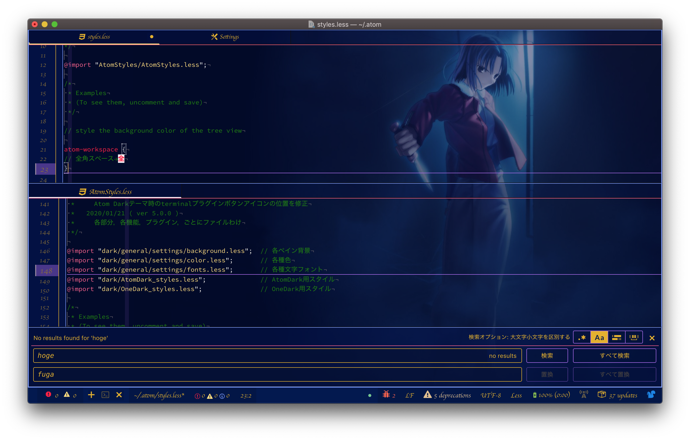

<h1>AtomStyles</h1>

github製テキストエディタ「Atom」のスタイルシートです． 
「カスタムメイド」ならぬ「カスタムAtom」作成のご参考になればと思います． 
Windows非対応．Mac使用者で，ダークテーマを使用している方オススメ． 
もし，「あ？使えねーぞ？ぶっ飛ばすぞfu**がぁ！」などあれば日本語で具体的にご指摘いただけると幸いです． 

<h2>イメージ</h2>

<h2>推奨環境</h2>
<ul>
    <li>OS:macOS Mojave 10.14.3</li>
    <li>macOS版Atom 1.43.0</li>
    <li>
        以下のプラグインがインストールされていること
        <ul>
            <li>Japanese menu:日本語化プラグイン</li>
            <li>Show Ideographic space:全角スペース可視化プラグイン</li>
        </ul>
    </li>
</ul>

<h2>できること</h2>
<ul>
    <li>
        背景
        <ul>
            <li>作業スペース全体の背景色，背景画像の設定</li>
            <li>各ペインごとの背景色，背景画像の設定</li>
        </ul>
    </li>
    <li>
        ペイン
        <ul>
            <li>ペイン分割線色の変更</li>
            <li>ツールバー，タブバーとの境界線色の変更</li>
            <li>文字色，文字フォントの変更</li>
            <li>各種ボタンの枠線色，背景色，文字色，文字フォントの設定</li>
        </ul>
    </li>
    <li>
        タブ
        <ul>
            <li>タブバー背景色の変更</li>
            <li>タブ文字フォント，文字色の変更</li>
            <li>アクティブタブ背景色，インジケーター色，文字フォント，文字色，文字サイズの変更</li>
            <li>アクティブペインタブ背景色，インジケーター色，文字フォント，文字色，文字サイズの変更</li>
        </ul>
    </li>
    <li>
        エディタ部分
        <ul>
            <li>行番号表示部の背景色変更</li>
            <li>行番号の文字フォント，文字色，文字サイズの変更</li>
            <li>カーソルライン行番号の背景色，文字色，文字サイズの変更</li>
            <li>テキスト選択中の行番号の背景色，文字色，文字フォント，文字サイズの変更</li>
            <li>カーソル色の変更</li>
            <li>カーソルライン水平線色，垂直線色の変更</li>
            <li>テキスト選択部分の背景色変更</li>
            <li>全角スペース背景色，代替文字，文字色の変更</li>
            <li>コメント文字色の変更</li>
        </ul>
    </li>
</ul>
〜and more〜

<h2>適用方法</h2>
<ol>
    <li>緑色のボタン「Clone or download」＞「Download ZIP」をクリックし，AtomStylesをダウンロードする．</li>
    <li>ダウンロードしたzipフォルダを解凍する．解凍後のフォルダを「~/.atom」に保存する．</li>
    <li>Atom.appを起動し，メニューバー の「Atom」＞「スタイルシート」を選択する．「styles.less」ファイルが開く．</li>
    <li>
        「styles.less」ファイルの「atom-workspace」前に
        <pre><code>@import "(解凍後のフォルダ名)/AtomStyles.less";</code></pre>
        を記述する． 
        例1）解凍後のフォルダ名が「AtomStyles-master」の場合，
            <pre><code>@import "AtomStyles-master/AtomStyles.less";</code></pre>
            を記述する． 
        例2）解凍後のフォルダ名が「AtomStyles-ver_5.0.0」の場合，
            <pre><code>@import "AtomStyles-ver_5.0.0/AtomStyles.less";</code></pre>
            を記述する．
    </li>
    <li>「styles.less」ファイルを上書き保存する．</li>
    <li>
        「~/.atom/AtomStyles/dark/general/settings」内の各ファイルを編集して自分好みのエディタを作成する．編集するファイルは以下の通り．
        <ul>
            <li>background.less:背景画像の変更</li>
            <li>color:各種文字色の変更</li>
            <li>fonts:各種文字フォントの変更</li>
        </ul>
    </li>
    <li>行った変更は「styles.less」ファイルを上書き保存すると適用される．</li>
</ol>
