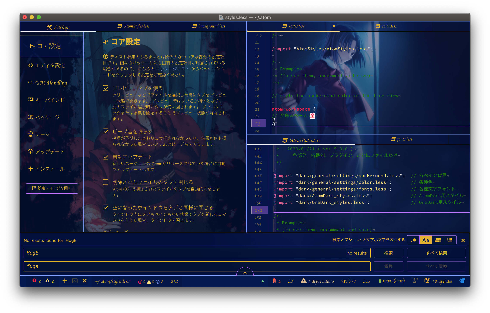

#AtomStyles

github製テキストエディタ「Atom」のスタイルシートです． 
「カスタムメイド」ならぬ「カスタムAtom」作成のご参考になればと思います． 
Windows非対応．Mac使用者で，ダークテーマを使用している方オススメ． 
もし，「あ？使えねーぞ？ぶっ飛ばすぞfu**がぁ！」などあれば日本語で具体的にご指摘いただけると幸いです． 

##イメージ
 

##推奨環境
-OS:macOS Mojave 10.14.3
-macOS版Atom 1.43.0
-以下のプラグインがインストールされていること
    -Japanese menu
    -Show Ideographic space

##できること
-背景
    -作業スペース全体の背景色，背景画像の設定
    -各ペインごとの背景色，背景画像の設定
-ペイン
    -ペイン分割線色の変更
    -ツールバー，タブバーとの境界線色の変更
    -文字色，文字フォントの変更
-タブ
    -タブバー背景色の変更
    -タブ文字フォント，文字色の変更
    -アクティブタブ背景色，インジケーター色，文字フォント，文字色，文字サイズの変更
    -アクティブペインタブ背景色，インジケーター色，文字フォント，文字色，文字サイズの変更
-エディタ部分
    -行番号表示部の背景色変更
    -行番号の文字フォント，文字色，文字サイズの変更
    -カーソルライン行番号の背景色，文字色，文字サイズの変更
    -テキスト選択中の行番号の背景色，文字色，文字フォント，文字サイズの変更
    -カーソル色の変更
    -カーソルライン水平線色，垂直線色の変更
    -テキスト選択部分の背景色変更
    -全角スペース背景色，代替文字，文字色の変更
    -コメント文字色の変更
〜and more〜

##適用方法
1. 緑色のボタン「clone or Download」＞「Download Zip」をクリックし，AtomStylesをダウンロードする．
2. ダウンロードしたzipフォルダを解凍する．解凍後のフォルダを「~/.atom」に保存する．
3. Atom.appを起動し，メニューバー の「Atom」＞「スタイルシート」を選択する．「styles.less」ファイルが開く．
4. 「styles.less」ファイルの「atom-workspace」前に「<pre><code>@import "AtomStyles/AtomStyles.less"<code><pre>」を記述する．
5. 「styles.less」ファイルを上書き保存する．
